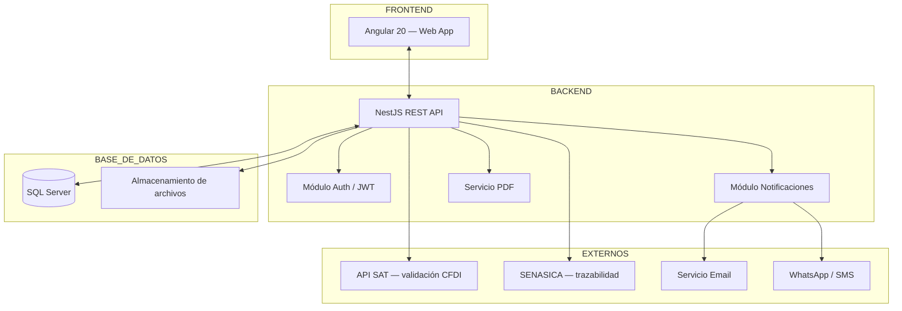
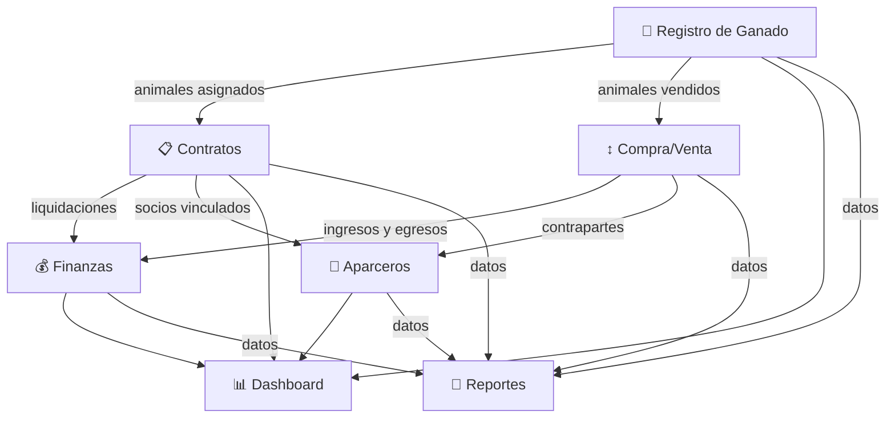
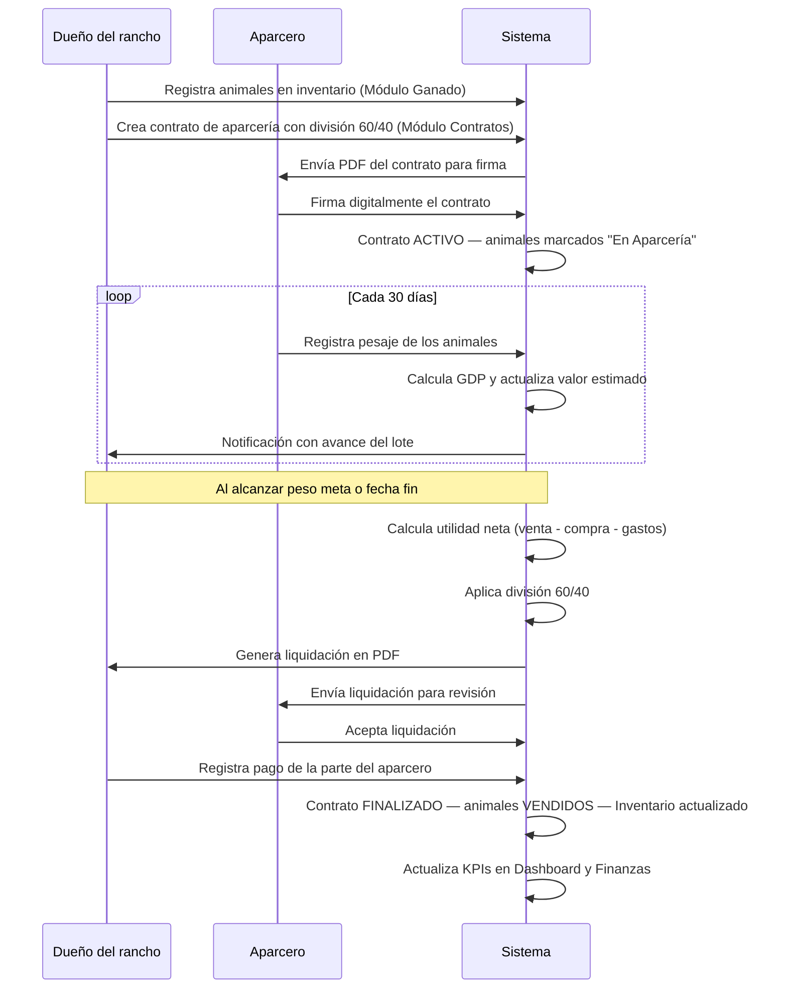
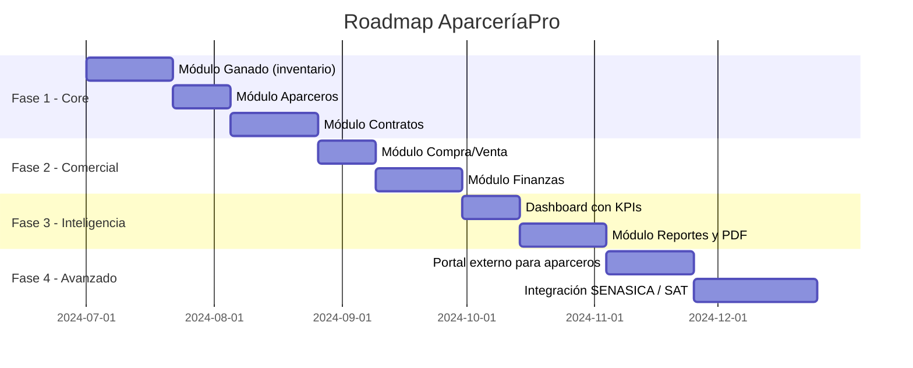

# 🐄 AparceríaPro — Documentación General del Sistema
> Sistema de administración de aparcería y compra-venta de ganado

---

## Visión del sistema

**AparceríaPro** es una plataforma web diseñada para digitalizar y profesionalizar la administración del negocio ganadero en México. Atiende específicamente las necesidades de productores que operan bajo esquemas de **aparcería pecuaria**, donde la gestión de contratos, inventario y finanzas es compleja y actualmente se realiza en papel o sin ningún control formal.

---

## Módulos del sistema

| # | Módulo | Propósito principal | Usuarios clave |
|---|---|---|---|
| 1 | [Dashboard General](./01_DASHBOARD.md) | Centro de comando — KPIs y alertas en tiempo real | Dueño, administrador |
| 2 | [Registro de Ganado](./02_REGISTRO_GANADO.md) | Inventario individual de animales con trazabilidad completa | Administrador, vaquero |
| 3 | [Contratos de Aparcería](./03_CONTRATOS.md) | Gestión del ciclo completo de cada contrato | Administrador, aparcero |
| 4 | [Compra / Venta](./04_COMPRA_VENTA.md) | Registro de transacciones con cálculo de utilidad real | Administrador, contador |
| 5 | [Finanzas](./05_FINANZAS.md) | Estado de resultados, flujo de caja y control presupuestal | Dueño, contador |
| 6 | [Aparceros](./06_APARCEROS.md) | Directorio de socios con historial de desempeño | Administrador |
| 7 | [Reportes](./07_REPORTES.md) | Exportación de documentos para trámites, socios y auditorías | Todos |

---

## Arquitectura general del sistema

---

## Diagrama de relación entre módulos

---

## Flujo de negocio completo (de punta a punta)

---

## Roles del sistema

| Rol | Permisos |
|---|---|
| **Administrador** | Acceso total a todos los módulos |
| **Dueño / Propietario** | Dashboard, Finanzas, Reportes (solo lectura en Ganado/Contratos) |
| **Capturista** | Registro de Ganado, Compra/Venta (sin eliminar) |
| **Contador** | Finanzas, Reportes, Compra/Venta (solo lectura) |
| **Aparcero** (portal externo) | Ver sus contratos, pesajes e historial propio |

---

## Stack tecnológico recomendado

| Capa | Tecnología | Justificación |
|---|---|---|
| Frontend | Angular 20 (Signals + Standalone) | Arquitectura moderna, rendimiento, ecosistema enterprise |
| Backend | NestJS + TypeORM | Modular, escalable, soporte SQL Server nativo |
| Base de datos | SQL Server / SQLite (dev) | Robustez para datos financieros, soporte ACID |
| Autenticación | JWT + Refresh tokens | Seguridad estándar para APIs |
| PDF | Puppeteer / PDFKit | Generación de documentos legales con firma |
| Almacenamiento | S3 / Azure Blob | Documentos, contratos, fotos de ganado |
| Despliegue | PM2 + Nginx + Angular SSR | Producción estable y SEO-ready |

---

## Hoja de ruta de desarrollo sugerida

