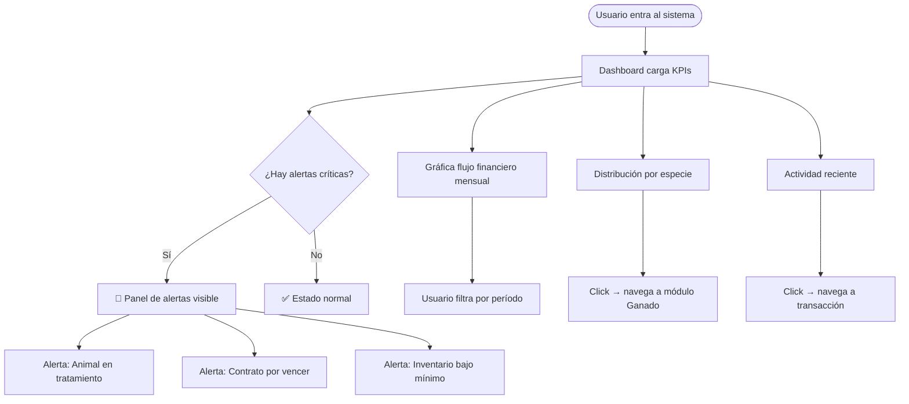
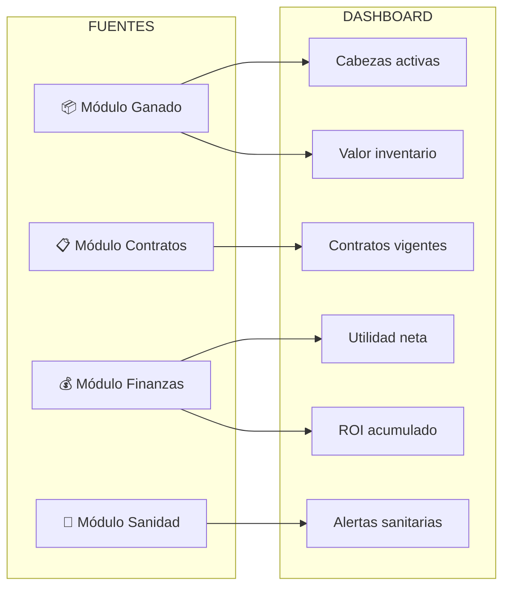
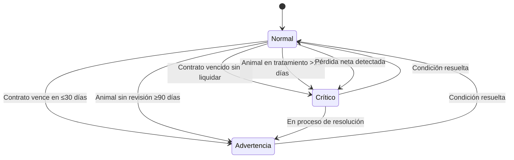

# 📊 Módulo 1 — Dashboard General
> **AparceríaPro** · Documentación técnica y funcional

---

## ¿Qué es y para qué sirve?

El Dashboard es el **centro de comando operativo** del sistema. Concentra en una sola pantalla los indicadores más críticos del negocio ganadero: inventario vivo, salud financiera, contratos activos y alertas de atención. Está diseñado para que el administrador o dueño tome decisiones informadas en segundos, sin necesidad de navegar entre módulos.

En la industria pecuaria, la pérdida de utilidad frecuentemente ocurre por **falta de visibilidad en tiempo real**: un animal enfermo que no se detecta a tiempo, un contrato que vence sin liquidarse, o una compra que descapitaliza la operación. El dashboard previene todos estos escenarios.

---

## Información que concentra

| Categoría | Dato | Frecuencia de actualización |
|---|---|---|
| Inventario | Total de cabezas activas por especie | Tiempo real |
| Finanzas | Ingresos / Egresos / Utilidad neta | Al registrar transacción |
| Contratos | Activos, por vencer (≤30 días), finalizados | Tiempo real |
| Sanidad | Animales en tratamiento / alertas | Tiempo real |
| Aparceros | Socios activos y monto comprometido | Tiempo real |
| Mercado | Precio estimado del kg en pie (configurable) | Manual / API externa |

---

## Diagrama de flujo del Dashboard

---

## Diagrama de KPIs y sus fuentes

---

## Alertas inteligentes

El sistema debe generar alertas automáticas basadas en reglas configurables:

---

## Campos de configuración del Dashboard

- **Rancho activo**: nombre, RFC, estado/municipio
- **Ejercicio fiscal**: año o período personalizado
- **Moneda base**: MXN (con soporte futuro USD)
- **Precio de referencia por kg**: actualizable manualmente
- **Widgets activos**: el usuario decide cuáles KPIs mostrar
- **Umbral de alertas**: días de anticipación configurables

---

## Ventaja competitiva en la industria

> La mayoría de los ranchos llevan la administración en **cuadernos físicos o Excel sin fórmulas**. Un dashboard digitalizado permite:
> - Detectar pérdidas antes de que sucedan
> - Presentar reportes a socios en tiempo real
> - Acceder al estado del negocio desde cualquier dispositivo
> - Comparar el desempeño entre temporadas
