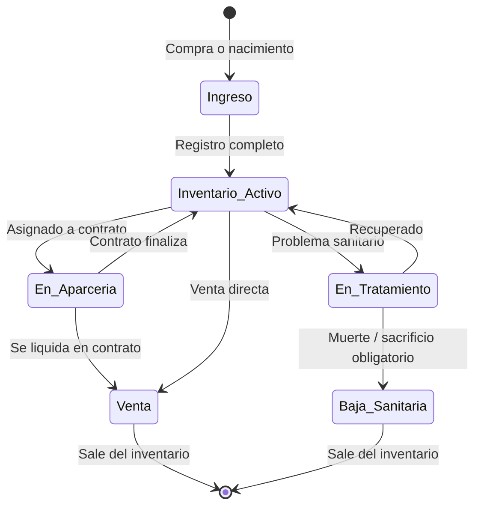
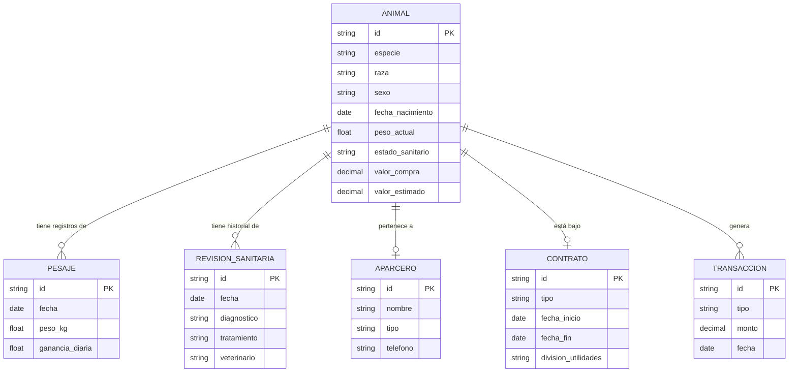
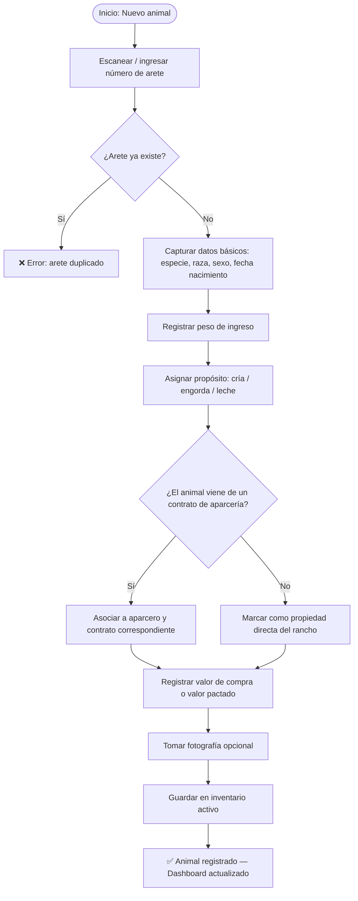
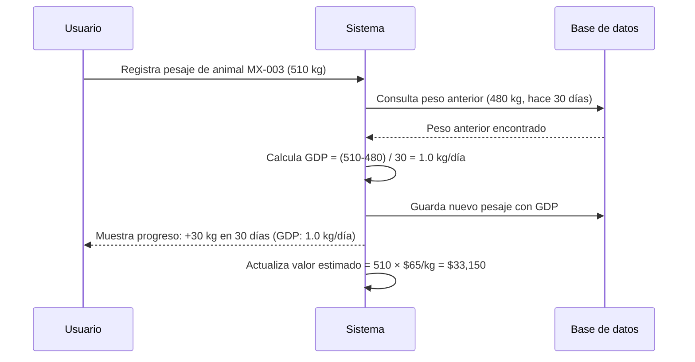

# 🐄 Módulo 2 — Registro de Ganado (Inventario)
> **AparceríaPro** · Documentación técnica y funcional

---

## ¿Qué es y para qué sirve?

El Registro de Ganado es el **corazón del sistema**: sin un inventario preciso, no es posible calcular utilidades reales, liquidar contratos correctamente ni tomar decisiones de compra/venta. Este módulo funciona como el expediente clínico y comercial de cada animal.

En México, la trazabilidad del ganado es exigida por la **SENASICA** (Servicio Nacional de Sanidad, Inocuidad y Calidad Agroalimentaria) y es requisito para exportar o ingresar a ciertos mercados. Un sistema de registro completo da ventaja legal y comercial.

---

## Entidades principales

### Animal (ficha individual)

| Campo | Tipo | Descripción |
|---|---|---|
| ID / Arete | Texto único | Identificador físico del animal (arete oficial SENASICA) |
| Especie | Catálogo | Bovino, Ovino, Caprino, Equino, Porcino |
| Raza | Catálogo | Angus, Hereford, Simmental, Charolais, etc. |
| Sexo | Enum | Macho / Hembra / Castrado |
| Fecha de nacimiento | Fecha | Para cálculo automático de edad |
| Peso de ingreso | Decimal (kg) | Peso al momento del registro |
| Peso actual | Decimal (kg) | Actualizable en cada revisión |
| Color / Señas | Texto | Descripción física para identificación rápida |
| Procedencia | Texto | Rancho, ejido o productor de origen |
| Aparcero asignado | FK → Aparcero | Dueño o co-propietario del animal |
| Contrato asociado | FK → Contrato | Si aplica aparcería |
| Propósito | Enum | Cría, Engorda, Leche, Doble propósito, Reproductor |
| Estado sanitario | Enum | Sano, En tratamiento, Cuarentena, Baja |
| Fecha de ingreso | Fecha | Al inventario del rancho |
| Valor de compra | Decimal (MXN) | Costo de adquisición |
| Valor estimado actual | Decimal (MXN) | Calculado por peso × precio kg en pie |
| Fotografía | Imagen | Opcional, para identificación visual |
| Notas | Texto libre | Observaciones del administrador |

---

## Diagrama de ciclo de vida de un animal

---

## Diagrama de relaciones del Animal con otros módulos

---

## Flujo de registro de un animal nuevo

---

## Control de pesajes (ganancia de peso)

El seguimiento del peso es clave para determinar la **rentabilidad real de la engorda**:

---

## Historial sanitario

Cada animal debe tener expediente de:
- Vacunas aplicadas (fecha, tipo, dosis, veterinario)
- Desparasitaciones internas y externas
- Tratamientos médicos (diagnóstico, medicamento, dosis, duración)
- Cirugías o procedimientos (descorne, castración, marcaje)
- Mortalidad o bajas (causa, fecha, peso final)

---

## Ventaja competitiva en la industria

> Con este módulo, el rancho puede:
> - **Acreditar trazabilidad** ante compradores, exportadores y autoridades (SENASICA / TIF)
> - Calcular automáticamente la **ganancia diaria de peso (GDP)**
> - Identificar animales **improductivos** que consumen recursos sin generar utilidad
> - Generar **constancias de existencia** para trámites legales y crediticios
> - Comparar el desempeño de razas y propósitos entre temporadas
