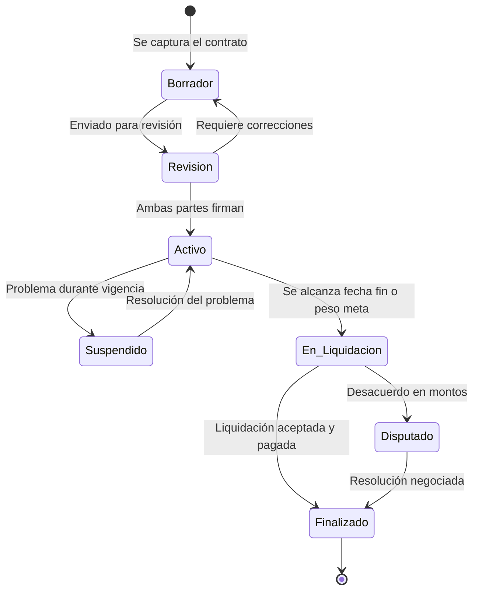
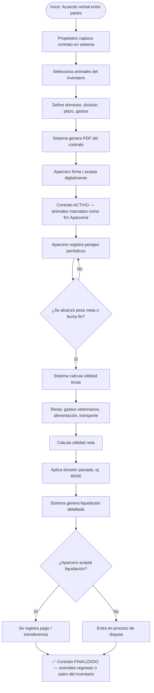
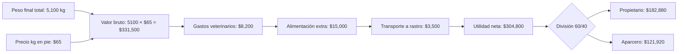
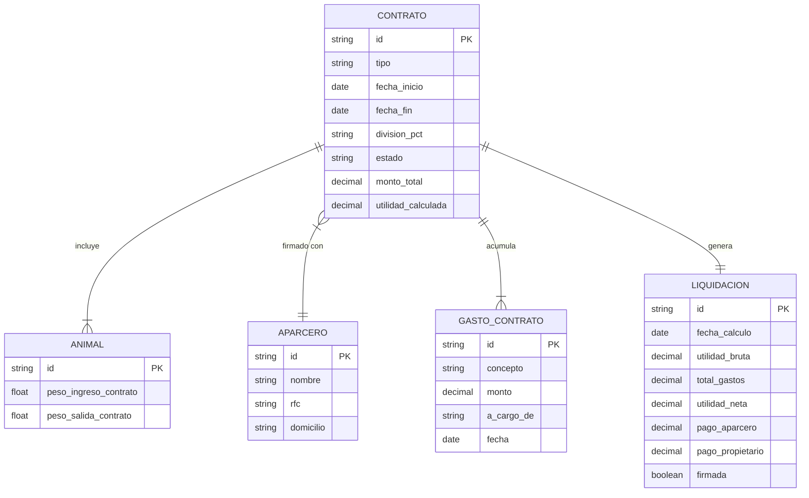

# 📋 Módulo 3 — Contratos de Aparcería
> **AparceríaPro** · Documentación técnica y funcional

---

## ¿Qué es la Aparcería Ganadera?

La **aparcería pecuaria** es un contrato en el que el dueño del capital (animales, tierra, recursos) entrega ganado a un aparcero para que lo cuide, críe o engorde, a cambio de dividir los beneficios según lo pactado. Está regulada en México por el **Código Agrario** y el **Código Civil Federal (Art. 2741-2766)**.

Existen dos tipos principales:
- **Aparcería de Cría**: el aparcero cuida los vientres, y las crías se reparten al nacimiento o al destete
- **Aparcería de Engorda**: el aparcero alimenta y cuida el ganado hasta el peso de mercado; la utilidad se divide al vender

---

## Campos del Contrato

| Campo | Tipo | Descripción |
|---|---|---|
| Número de contrato | Texto único | Folio interno (ej. CONT-2024-001) |
| Tipo de aparcería | Enum | Cría / Engorda / Mixta |
| Aparcero | FK → Aparcero | Quien recibe el ganado |
| Propietario | FK → Rancho | Quien entrega el ganado |
| Fecha de inicio | Fecha | Inicio del contrato |
| Fecha de fin estimada | Fecha | Plazo acordado |
| Animales incluidos | Lista FK → Animal | Aretes específicos |
| División de utilidades | Texto | Ej: 50/50, 60/40, 70/30 |
| Gastos a cargo de | Enum | Aparcero / Propietario / Compartidos |
| Precio de referencia kg | Decimal | Para calcular valor en pie |
| Peso de entrega inicial | Decimal (kg) | Peso total al iniciar |
| Peso mínimo de venta | Decimal (kg) | Peso acordado para vender |
| Cláusulas especiales | Texto libre | Mortalidad, enfermedades, seguros |
| Estado | Enum | Borrador / Activo / Suspendido / Finalizado |
| Firma del aparcero | Booleano | Acuse digital |
| Firma del propietario | Booleano | Acuse digital |
| Notario / Testigos | Texto | Opcional para contratos formales |

---

## Diagrama de estados de un Contrato

---

## Flujo completo de un contrato de engorda

---

## Cálculo de liquidación de aparcería de engorda

---

## Diagrama entidad-relación del Contrato

---

## Tipos de división y cómo impactan la utilidad

| Modalidad | Propietario | Aparcero | Cuándo usarla |
|---|---|---|---|
| 50/50 | 50% | 50% | Aparcero aporta tierra + mano de obra + alimentación |
| 60/40 | 60% | 40% | Propietario aporta más capital o ganado fino |
| 70/30 | 70% | 30% | Aparcero solo da mano de obra, todo lo demás es del propietario |
| Variable | Negociado | Negociado | Por metas de peso, crías nacidas, mortalidad cero |

---

## Ventaja competitiva en la industria

> Este módulo digitaliza lo que en el campo se hace en "acuerdos de palabra" o en hojas sueltas, generando:
> - **Contratos con validez documental** (PDF firmado, con fecha y condiciones)
> - **Liquidaciones transparentes y auditables** que evitan conflictos entre socios
> - **Historial por aparcero**: quién ha sido rentable, quién ha tenido pérdidas
> - **Alertas automáticas** cuando se acerca la fecha de vencimiento o el peso meta
> - Base para acceder a **financiamiento bancario** (los contratos formales son garantía)
