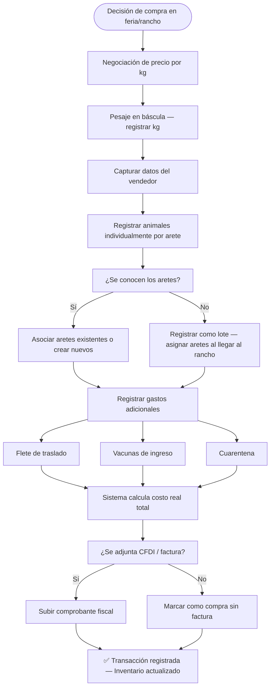
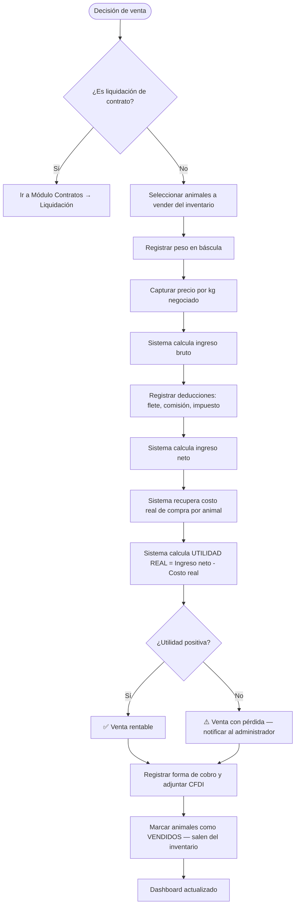
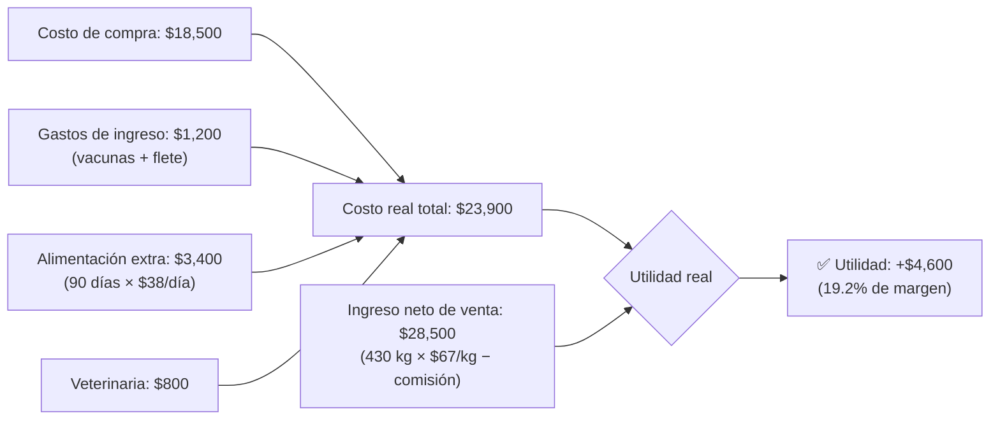
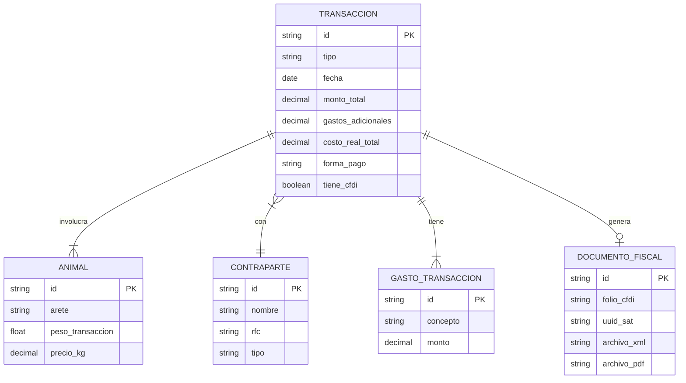

# ↕ Módulo 4 — Compra / Venta de Ganado
> **AparceríaPro** · Documentación técnica y funcional

---

## ¿Qué es y para qué sirve?

Este módulo registra **todas las transacciones comerciales** que involucran movimiento de animales: compras al mercado, ventas a rastros o empresas, canje entre socios, subasta, etc. Es la fuente principal del flujo de caja del negocio y el historial que permite calcular el **costo real de producción** y la **utilidad por lote**.

En la industria ganadera, muchas pérdidas ocurren porque no se documentan correctamente los costos de adquisición y los gastos asociados (flete, cuarentena, vacunas de ingreso), inflando artificialmente las utilidades al vender.

---

## Campos de una Transacción

### Compra

| Campo | Tipo | Descripción |
|---|---|---|
| Folio | Texto único | Ej: CMP-2024-001 |
| Fecha | Fecha/hora | Momento exacto de la transacción |
| Tipo | Enum | Compra directa / Subasta / Canje / Donación |
| Vendedor | Texto / FK → Aparcero | Quién vende |
| Animales adquiridos | Lista FK → Animal | Aretes específicos o lote |
| Peso total de compra | Decimal (kg) | Peso en báscula al comprar |
| Precio por kg | Decimal (MXN) | Precio acordado |
| Monto total | Decimal (MXN) | Peso × precio/kg |
| Gastos adicionales | Lista de conceptos | Flete, cuarentena, vacunas, comisión |
| Costo total real | Decimal (MXN) | Monto + gastos adicionales |
| Forma de pago | Enum | Efectivo / Transferencia / Cheque / Crédito |
| Comprobante fiscal | Booleano + archivo | CFDI / factura adjunta |
| Notas | Texto libre | Observaciones |

### Venta

| Campo | Tipo | Descripción |
|---|---|---|
| Folio | Texto único | Ej: VTA-2024-001 |
| Fecha | Fecha/hora | Momento de la venta |
| Tipo | Enum | Rastro / Directo a carnicería / Exportación / Subasta |
| Comprador | Texto | Razón social o nombre |
| Animales vendidos | Lista FK → Animal | Aretes específicos |
| Peso total de venta | Decimal (kg) | Peso en báscula al vender |
| Precio por kg | Decimal (MXN) | Precio de venta |
| Ingresos brutos | Decimal (MXN) | Peso × precio/kg |
| Deducciones | Lista | Comisiones, transporte, impuestos |
| Ingreso neto | Decimal (MXN) | Ingreso bruto - deducciones |
| Contrato relacionado | FK → Contrato | Si es liquidación de aparcería |
| Utilidad por animal | Decimal (MXN) | Ingreso neto - costo real de compra |

---

## Diagrama de flujo de una Compra

---

## Diagrama de flujo de una Venta

---

## Cálculo de utilidad real por animal

---

## Diagrama entidad-relación de la Transacción

---

## Indicadores clave del módulo

| Indicador | Fórmula | Para qué sirve |
|---|---|---|
| Margen por animal | (Venta neta − Costo real) / Costo real × 100 | Medir rentabilidad individual |
| GDP (Ganancia diaria de peso) | (Peso venta − Peso compra) / días | Evaluar eficiencia de la engorda |
| Costo por kg ganado | Gastos totales / (Peso venta − Peso compra) | Comparar lotes y razas |
| Precio promedio compra | Total pagado / kg total comprado | Referencia para negociar |
| Precio promedio venta | Total cobrado / kg total vendido | Referencia para negociar |
| ROI del lote | Utilidad / Inversión × 100 | Comparar entre lotes y temporadas |

---

## Ventaja competitiva en la industria

> El ganadero promedio **no sabe el costo real de producción** porque no suma los gastos de alimentación, veterinaria y transporte al precio de compra. Este módulo:
> - Calcula automáticamente el **costo de producción por animal**
> - Identifica **lotes y razas más rentables**
> - Genera evidencia de compra-venta para **trámites ante el SAT**
> - Detecta si una venta es rentable **antes de cerrar el trato**
> - Conecta directamente con los módulos de Finanzas y Contratos para coherencia total
