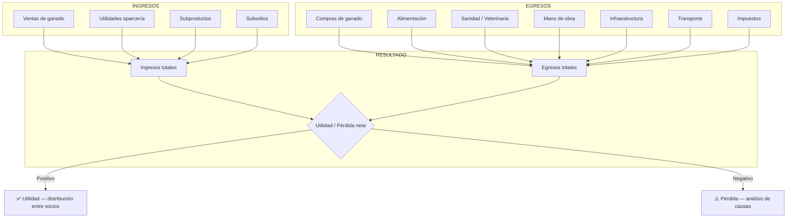
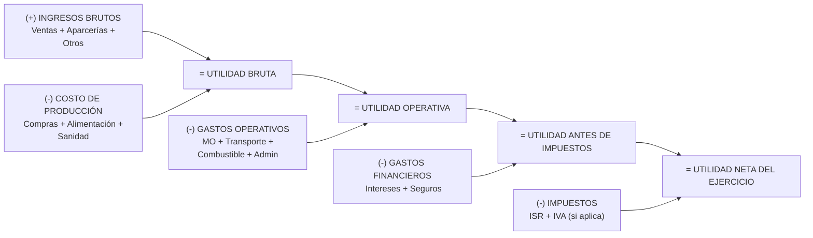
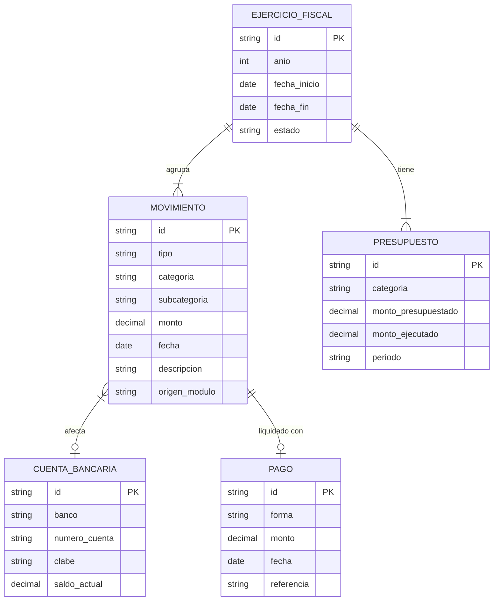
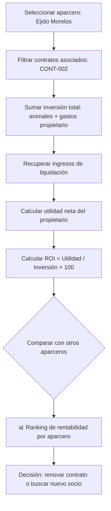

# 💰 Módulo 5 — Finanzas y Utilidades / Pérdidas
> **AparceríaPro** · Documentación técnica y funcional

---

## ¿Qué es y para qué sirve?

El módulo de Finanzas es el **cerebro contable** del sistema. Consolida todos los movimientos de dinero del rancho: compras, ventas, gastos operativos, pagos a aparceros, veterinaria, alimentación, maquinaria y cualquier otro egreso. Genera el **estado de resultados** y permite proyectar la rentabilidad futura.

En el campo mexicano, muchos productores **mezclan gastos personales con gastos del negocio**, lo que hace imposible conocer la utilidad real. Este módulo separa claramente ambas dimensiones y proporciona visibilidad financiera completa.

---

## Categorías financieras del negocio ganadero

### Ingresos
| Categoría | Ejemplos |
|---|---|
| Venta de ganado en pie | Novillos, sementales, vientres |
| Venta de ganado en canal | A rastros TIF, carnicerías |
| Utilidad por aparcería | Liquidación de contratos activos |
| Venta de subproductos | Leche, lana, estiércol, cueros |
| Venta de crías | Becerros, corderos, cabritos al destete |
| Rentas | Arrendamiento de potreros o instalaciones |
| Subsidios/apoyos | PROAGRO, PROGAN, SAGARPA |

### Egresos
| Categoría | Ejemplos |
|---|---|
| Compra de ganado | Adquisición de nuevos animales |
| Alimentación | Forraje, alimento balanceado, suplementos |
| Sanidad animal | Vacunas, medicamentos, veterinario |
| Mano de obra | Vaqueros, caporales, personal eventual |
| Infraestructura | Corrales, bebederos, comederos, alambrado |
| Maquinaria y equipo | Tractores, carros de reparto, báscula |
| Combustibles | Diesel, gasolina |
| Transporte de ganado | Fletes a feria, rastro, rancho |
| Impuestos y trámites | Predial, permisos SEMARNAT, guías de traslado |
| Seguros | Ganado asegurado contra muerte o robo |
| Gastos financieros | Intereses de crédito rural |

---

## Diagrama del flujo financiero completo



---

## Estado de Resultados (estructura del módulo)



---

## Diagrama de la estructura de datos financiera



---

## Análisis de rentabilidad por aparcero



---

## Indicadores financieros clave (KPIs)

| KPI | Fórmula | Benchmark ganadero |
|---|---|---|
| ROI del ejercicio | Utilidad neta / Inversión total × 100 | > 20% anual es bueno |
| Margen de utilidad bruta | Utilidad bruta / Ingresos × 100 | > 35% en engorda |
| Costo de producción por kg | Egresos totales / kg producidos | Comparar con precio de mercado |
| Punto de equilibrio | Egresos fijos / Margen contribución | Mínimo de ventas para no perder |
| Liquidez | Activo circulante / Pasivo circulante | > 1.5 es saludable |
| Rotación de inventario | Ventas / Valor promedio inventario | Ciclos por año |

---

## Control presupuestal

El sistema permite definir un **presupuesto anual por categoría** y comparar en tiempo real la ejecución:

```
Alimentación    ████████████░░░░  75% ejecutado  ($45,000 / $60,000)
Veterinaria     ████████░░░░░░░░  52% ejecutado  ($12,500 / $24,000)
Transporte      ██████████████░░  88% ejecutado  ($15,800 / $18,000) ⚠️
Mano de obra    ████████████████  101% ejecutado ($36,200 / $36,000) 🔴
```

---

## Ventaja competitiva en la industria

> Con este módulo, el negocio ganadero se profesionaliza al nivel de una empresa formal:
> - **Estado de resultados real** — no más "creo que gané dinero este año"
> - **Presupuesto vs. real**: detecta desvíos antes de que se vuelvan crisis
> - **Flujo de caja proyectado**: planifica cuándo habrá liquidez para comprar
> - **Evidencia financiera** para acceder a **créditos rurales** (FIRA, FND, banca comercial)
> - **Comparativo entre temporadas**: identifica si el negocio está creciendo o deteriorándose
> - Cumplimiento **fiscal ante el SAT** con registros ordenados y exportables
