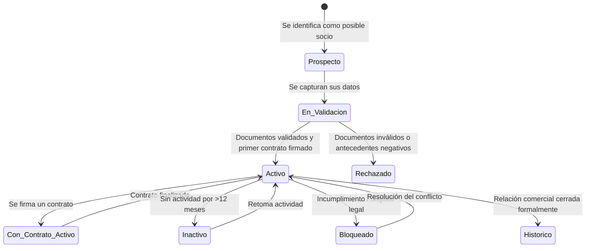
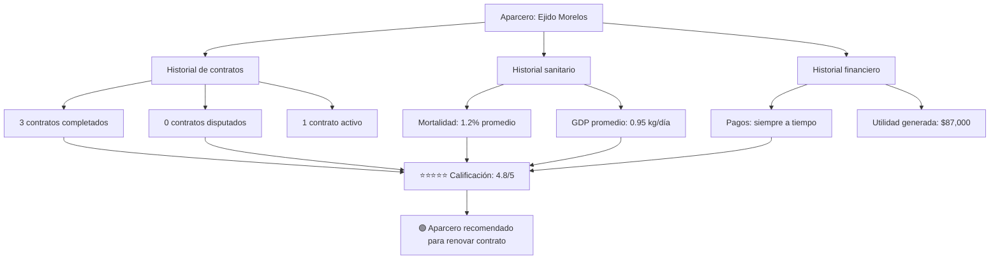
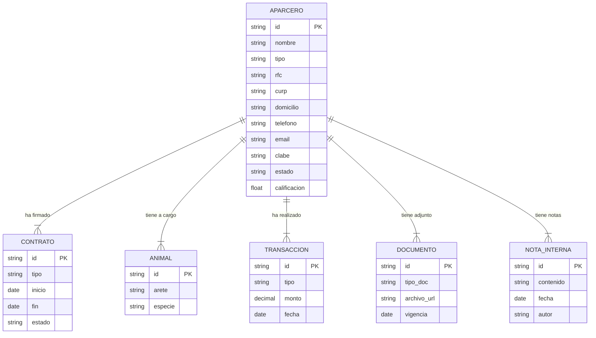
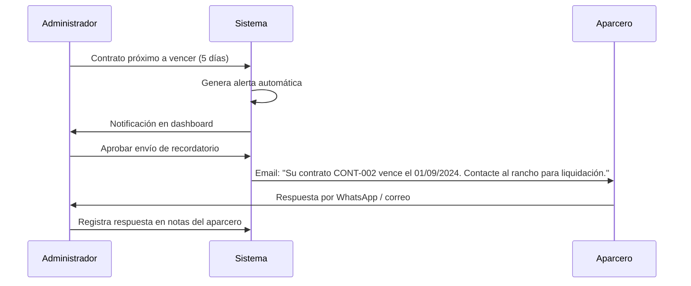

# 👥 Módulo 6 — Gestión de Socios y Aparceros
> **AparceríaPro** · Documentación técnica y funcional

---

## ¿Qué es y para qué sirve?

Este módulo es el **directorio relacional de socios de negocio** del rancho. Gestiona la información de todas las personas, ejidos o empresas con quienes se realizan contratos de aparcería, compras recurrentes o ventas directas. Va más allá de un simple catálogo: construye un **historial de desempeño** por socio que permite tomar mejores decisiones comerciales.

En la práctica ganadera, la relación con los aparceros es de **largo plazo y basada en confianza**. Digitalizar esa relación con datos objetivos (¿quién ha entregado mejores resultados?, ¿quién ha tenido más bajas?) reduce riesgos y profesionaliza los acuerdos.

---

## Tipos de Aparcero / Socio

| Tipo | Descripción | Características especiales |
|---|---|---|
| Productor individual | Persona física con ganado o tierra propia | RFC personal, CURP |
| Ejido | Núcleo agrario con derechos colectivos | Acta de asamblea, representante legal |
| Empresa / Rancho S.A. | Persona moral | RFC empresa, representante legal, acta constitutiva |
| Comprador recurrente | Rastro, carnicería, empresa cárnica | Datos fiscales para CFDI |
| Proveedor recurrente | Ferias ganaderas, agropecuarias | Datos para trazabilidad |

---

## Campos del Perfil del Aparcero

| Campo | Tipo | Descripción |
|---|---|---|
| ID interno | Texto único | Folio del sistema |
| Nombre / Razón social | Texto | Nombre completo o empresa |
| Tipo | Enum | Ver tabla anterior |
| RFC | Texto | Para facturación y trazabilidad |
| CURP | Texto | Solo personas físicas |
| Domicilio | Texto + mapa | Estado, municipio, localidad |
| Teléfono / WhatsApp | Texto | Contacto principal |
| Correo electrónico | Texto | Para envío de contratos y reportes |
| Número de cuenta bancaria | Texto | Para transferencias de liquidación |
| CLABE interbancaria | Texto | Pagos electrónicos |
| Referencias | Texto libre | Quién lo recomendó, historial previo |
| Documentos adjuntos | Archivos | INE, acta ejidal, acta constitutiva |
| Estado en el sistema | Enum | Activo / Inactivo / Bloqueado / Histórico |
| Calificación de confianza | 1–5 estrellas | Basada en historial de cumplimiento |
| Notas internas | Texto libre | Observaciones del administrador |

---

## Diagrama de ciclo de vida de un Aparcero

---

## Historial de desempeño del Aparcero

El sistema construye automáticamente un **score de confianza** basado en datos objetivos:

---

## Diagrama entidad-relación del Aparcero

---

## Indicadores de desempeño por Aparcero

| Indicador | Descripción |
|---|---|
| Contratos completados | Total de contratos finalizados sin disputa |
| Tasa de mortalidad | % de animales perdidos bajo su cuidado |
| GDP promedio | Ganancia diaria de peso en sus lotes |
| Utilidad generada | Total de utilidad producida en todos sus contratos |
| Tiempo promedio de respuesta | Qué tan rápido responde a comunicaciones |
| Pagos a tiempo | % de liquidaciones pagadas en la fecha acordada |
| Cumplimiento de pesajes | % de pesajes periódicos reportados puntualmente |

---

## Comunicación integrada

El módulo permite enviar directamente desde el sistema:

---

## Ventaja competitiva en la industria

> En el negocio ganadero, la selección de socios es crítica. Un aparcero irresponsable puede significar:
> - Alta mortalidad (pérdida directa de capital)
> - GDP bajo (engorda ineficiente, más tiempo = más gastos)
> - Conflictos legales al liquidar
>
> Este módulo permite:
> - **Elegir socios con base en datos**, no solo en recomendaciones verbales
> - Tener todos los **documentos legales al alcance** para cualquier trámite
> - **Comunicarse formalmente** con respaldo documental de cada intercambio
> - Construir una **red de proveedores y compradores** verificados y confiables
> - Presentar un **directorio profesional** ante instituciones financieras y sanitarias
