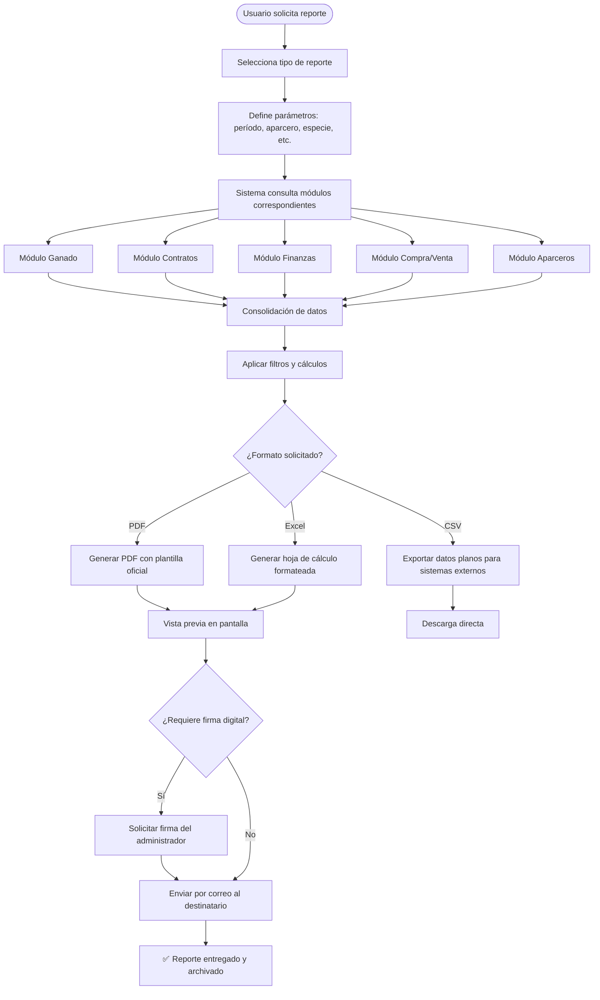
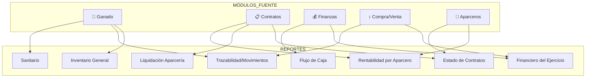

# 📊 Módulo 7 — Reportes y Estadísticas
> **AparceríaPro** · Documentación técnica y funcional

---

## ¿Qué es y para qué sirve?

El módulo de Reportes es la **capa de inteligencia del negocio**: convierte los datos capturados en todos los módulos en documentos, gráficas e indicadores accionables. Es el módulo que transforma AparceríaPro en una ventaja competitiva real, porque permite **mostrar el estado del negocio a socios, bancos, compradores y autoridades** con evidencia sólida.

En México, acceder a créditos rurales, certificaciones sanitarias o mercados de exportación requiere presentar información **organizada, verificable y con respaldo documental**. Este módulo lo hace posible.

---

## Catálogo de Reportes

### 1. Inventario General de Ganado
**Audiencia**: Administrador, socios, instituciones financieras, SENASICA  
**Contenido**: Listado completo de animales activos con especie, raza, edad, peso, valor estimado, estado sanitario y aparcero asignado  
**Formatos**: PDF, Excel, CSV  
**Frecuencia recomendada**: Mensual y ante auditorías

### 2. Estado de Contratos de Aparcería
**Audiencia**: Socios, notario, abogado  
**Contenido**: Contratos activos y finalizados con términos, división de utilidades, estado actual y montos liquidados  
**Formatos**: PDF con firmas digitales  
**Frecuencia recomendada**: Al inicio y cierre de cada contrato

### 3. Reporte Financiero del Ejercicio
**Audiencia**: Dueño, contador, banco, SAT  
**Contenido**: Estado de resultados completo — ingresos, egresos por categoría, utilidad bruta, operativa y neta  
**Formatos**: PDF, Excel  
**Frecuencia recomendada**: Mensual y anual

### 4. Liquidación de Aparcería
**Audiencia**: Aparcero, propietario, testigos  
**Contenido**: Cálculo detallado de la liquidación: pesajes, valor de venta, gastos deducidos, utilidad neta y monto por parte  
**Formatos**: PDF con validez legal (firmado digitalmente)  
**Frecuencia recomendada**: Al cierre de cada contrato

### 5. Rentabilidad por Aparcero
**Audiencia**: Administrador, socios inversionistas  
**Contenido**: Comparativo de utilidad generada, mortalidad, GDP y cumplimiento por aparcero  
**Formatos**: PDF, Excel  
**Frecuencia recomendada**: Semestral

### 6. Movimientos de Ganado (Trazabilidad)
**Audiencia**: SENASICA, TIF, exportadores, auditores  
**Contenido**: Historial completo de cada animal: origen, traslados, tratamientos, peso y destino final  
**Formatos**: PDF, CSV compatible con SIAP-SENASICA  
**Frecuencia recomendada**: Ante cualquier inspección o venta a canal formal

### 7. Reporte Sanitario
**Audiencia**: Médico veterinario, SENASICA, comprador  
**Contenido**: Vacunaciones, desparasitaciones, tratamientos y estado sanitario del hato  
**Formatos**: PDF  
**Frecuencia recomendada**: Antes de venta, feria o traslado interestatal

### 8. Flujo de Caja Proyectado
**Audiencia**: Dueño, contador, banco  
**Contenido**: Proyección de ingresos y egresos futuros basada en contratos activos y tendencias históricas  
**Formatos**: PDF, Excel  
**Frecuencia recomendada**: Mensual

---

## Diagrama del flujo de generación de reportes

---

## Diagrama de fuentes de datos por reporte

---

## Diagrama de estructura del reporte de Liquidación (el más crítico)

```mermaid
flowchart LR
    subgraph ENCABEZADO
        A1[Datos del rancho]
        A2[Datos del aparcero]
        A3[Folio y fecha de contrato]
    end

    subgraph CUERPO
        B1[Lista de animales: arete, peso entrada, peso salida]
        B2[Tabla de gastos deducibles]
        B3[Precio de venta aplicado]
        B4[Cálculo: ingreso bruto - gastos = utilidad neta]
        B5[Aplicación de división: 60/40 o la pactada]
    end

    subgraph RESULTADO
        C1[Monto a pagar al aparcero]
        C2[Monto retenido por el propietario]
        C3[Saldo de gastos por parte]
    end

    subgraph CIERRE
        D1[Firma digital del propietario]
        D2[Firma digital del aparcero]
        D3[Fecha y hora de aceptación]
        D4[UUID de validación del documento]
    end

    ENCABEZADO --> CUERPO --> RESULTADO --> CIERRE
```

---

## Estadísticas comparativas entre temporadas

El módulo genera comparativos automáticos:

| Indicador | 2022 | 2023 | 2024 | Tendencia |
|---|---|---|---|---|
| Cabezas manejadas | 42 | 55 | 60 | 📈 +9% |
| GDP promedio (kg/día) | 0.82 | 0.89 | 0.95 | 📈 +6.7% |
| Mortalidad (%) | 3.1% | 2.4% | 1.8% | 📉 Mejora |
| ROI del ejercicio | 18.2% | 22.7% | 27.4% | 📈 +4.7pp |
| Contratos liquidados sin disputa | 85% | 92% | 100% | 📈 Mejora |

---

## Ventaja competitiva en la industria

> El módulo de reportes es la **cara pública del negocio**. Permite:
> - **Acreditar trazabilidad** ante exportadores, TIF y SENASICA → acceso a mejores mercados
> - **Presentar estados financieros** ante bancos para obtener créditos rurales FIRA/FND
> - **Liquidar contratos** con documentos que tienen validez legal y reducen conflictos
> - **Comparar temporadas** para mejorar decisiones de compra, alimentación y selección de socios
> - **Demostrar profesionalismo** ante nuevos aparceros e inversionistas que quieran entrar al negocio
> - Preparar la operación para **certificaciones** (PROGAN, sistemas de calidad, exportación)
